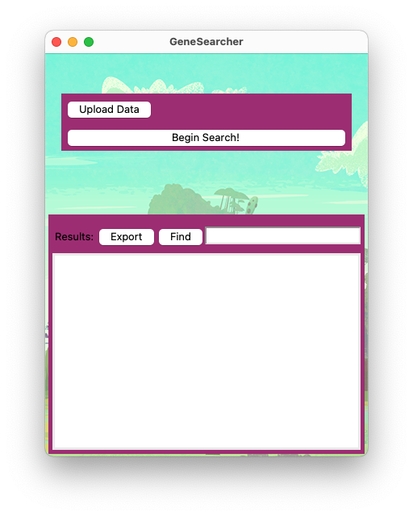
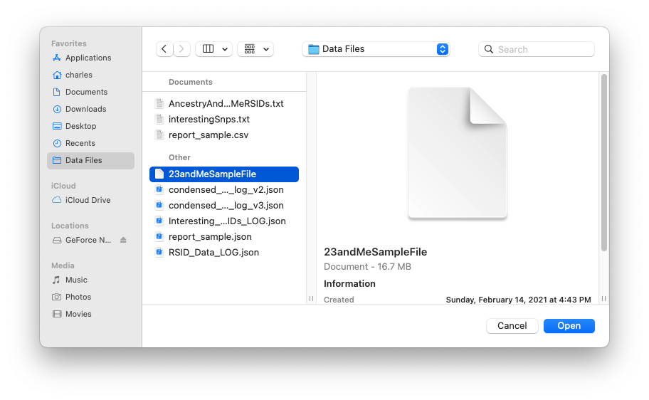
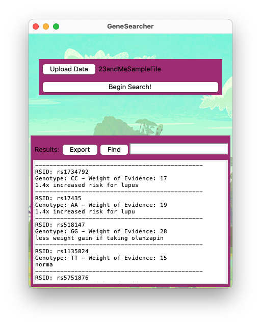

# CSE-115A-GeneSearcher
GeneSearcher allows the user discover information about themselves, based on their genetic data, using open resources. This is a class project for CSE 115A Intro to Software Engineering.

Users are able to input a text file containing their genetic information (these files are commonly available from commercial DNA testing services such as 23AndMe) then the program automatically process their genotype and check it's own dataset for entries matching the users particular genotype that might have interesting information. It then creates simple report based on it's findings wich are presented to the user.

## Usage
### MacOS
On MacOS the program must be run at the command line from its containing directory:
`python3 main.py`

### Windows
On Windows the program can be run from the command line, or installed as a regular desktop applicaton.

### Program Usage

The main interface of the program contains a button to select a data file and begin processing and a report frame where the data will be stored.

Simply click Upload Data to select the file that you would like to work with and a file selection dialog will open. Select your file and press open

Press "Being Search" to start processing your data.

The Export button will write the data to a file in the current directory named Report.csv and the Find button will move to and highlight the next instance of the value entered in to the search bar.

## Future Improvements
Future improvements include:
* The ability name exported reports and choose export format (.csv, .json, plain text, etc)
* A filtered report option. The user should be able to query for specific traits they are interested in and the program will generate a report containing only data relevant to that query.
* An information window that can help the user understand where / how to access there raw genetic material from websites such as 23AndMe
* Context discovery system that can use context provided by academic articles in dataset to understand what issues certain snps are related to. The current data set includes data points which have statements such as "10% increased risk" but do not include the necessary context to understand what that increased risk relates to. This context can usually be found in the referenced articles linked to by opensnp. A system that can crawl these articles in the data collection process and discover that context would greatly increase the usefulness of the product.
* Subject matter tags. These could be used to classify the snps in to broad categories that might make it easier to develop systems wich allow the user to filter the results down to just the information they are interested in learning about. 
* GUI enhancements
